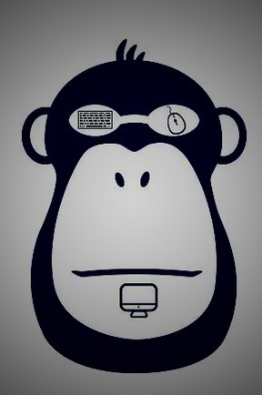

隔壁王小猿的博客

    

        
    

    

         一只不务正业的猿，一只不甘堕落的猿，一只挣扎在生存边缘的猿~ 
    

    

        **联系小猿: **  
        [GitHub](https://github.com/gbwxy)   
        [知乎](https://www.zhihu.com/people/wang-jun-96-9/posts)  
        [B站-隔壁王小猿](https://space.bilibili.com/21603486)   
        邮箱：zgwj906@gmail.com  
    

公众号：gbwxy-happy

