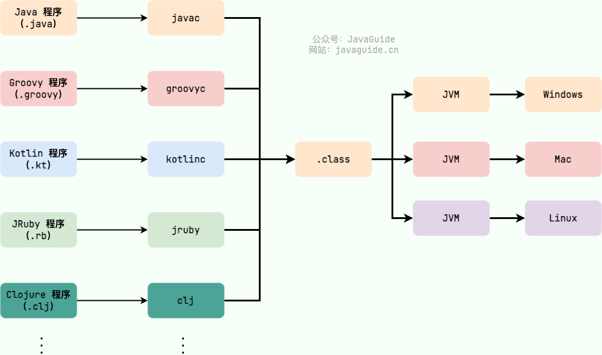
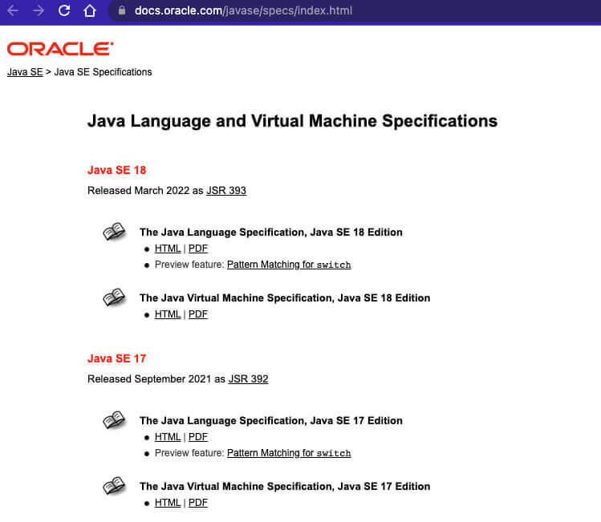
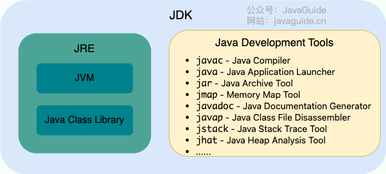
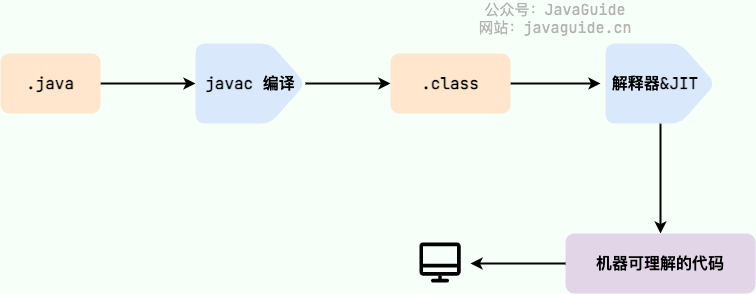

# 基础概念与常识

## Java 语言有哪些特点?

1. 简单易学（语法简单，上手容易）；
2. 面向对象（封装，继承，多态）；
3. 平台无关性（ Java 虚拟机实现平台无关性）；
4. 支持多线程；
5. 可靠性（具备异常处理和自动内存管理机制）；
6. 安全性（Java 语言本身的设计就提供了多重安全防护机制如访问权限修饰符、限制程序直接访问操作系统资源）；
7. 高效性（通过 Just In Time 编译器等技术的优化，Java 语言的运行效率还是非常不错的）；
8. 支持网络编程并且很方便；
9. 编译与解释并存；
10. ……

> “Write Once, Run Anywhere（一次编写，随处运行）”这句宣传口号，真心经典，流传了好多年！以至于，直到今天，依然有很多人觉得跨平台是 Java 语言最大的优势。实际上，跨平台已经不是 Java 最大的卖点了，各种 JDK 新特性也不是。目前市面上虚拟化技术已经非常成熟，比如你通过 Docker 就很容易实现跨平台了。在我看来，Java 强大的生态才是！

## Java SE vs Java EE

- Java SE（Java Platform，Standard Edition）: Java 平台标准版，Java 编程语言的基础，它包含了支持 Java 应用程序开发和运行的核心类库以及虚拟机等核心组件。Java SE 可以用于构建桌面应用程序或简单的服务器应用程序。
- Java EE（Java Platform, Enterprise Edition ）：Java 平台企业版，建立在 Java SE 的基础上，包含了支持企业级应用程序开发和部署的标准和规范（比如 Servlet、JSP、EJB、JDBC、JPA、JTA、JavaMail、JMS）。 Java EE 可以用于构建分布式、可移植、健壮、可伸缩和安全的服务端 Java 应用程序，例如 Web 应用程序。

简单来说，Java SE 是 Java 的基础版本，Java EE 是 Java 的高级版本。Java SE 更适合开发桌面应用程序或简单的服务器应用程序，Java EE 更适合开发复杂的企业级应用程序或 Web 应用程序。

除了 Java SE 和 Java EE，还有一个 Java ME（Java Platform，Micro Edition）。Java ME 是 Java 的微型版本，主要用于开发嵌入式消费电子设备的应用程序，例如手机、PDA、机顶盒、冰箱、空调等。Java ME 无需重点关注，知道有这个东西就好了，现在已经用不上了。

## JVM vs JDK vs JRE

### JVM

Java 虚拟机（Java Virtual Machine, JVM）是运行 Java 字节码的虚拟机。JVM 有针对不同系统的特定实现（Windows，Linux，macOS），目的是使用相同的字节码，它们都会给出相同的结果。字节码和不同系统的 JVM 实现是 Java 语言“一次编译，随处可以运行”的关键所在。

如下图所示，不同编程语言（Java、Groovy、Kotlin、JRuby、Clojure ...）通过各自的编译器编译成 `.class` 文件，并最终通过 JVM 在不同平台（Windows、Mac、Linux）上运行。

**JVM 并不是只有一种！只要满足 JVM 规范，每个公司、组织或者个人都可以开发自己的专属 JVM。** 也就是说我们平时接触到的 HotSpot VM 仅仅是是 JVM 规范的一种实现而已。

除了我们平时最常用的 HotSpot VM 外，还有 J9 VM、Zing VM、JRockit VM 等 JVM 。维基百科上就有常见 JVM 的对比：[Comparison of Java virtual machines](https://en.wikipedia.org/wiki/Comparison_of_Java_virtual_machines) ，感兴趣的可以去看看。并且，你可以在 [Java SE Specifications](https://docs.oracle.com/javase/specs/index.html) 上找到各个版本的 JDK 对应的 JVM 规范。

### JDK 和 JRE

JDK（Java Development Kit）是一个功能齐全的 Java 开发工具包，供开发者使用，用于创建和编译 Java 程序。它包含了 JRE（Java Runtime Environment），以及编译器 javac 和其他工具，如 javadoc（文档生成器）、jdb（调试器）、jconsole（监控工具）、javap（反编译工具）等。

JRE 是运行已编译 Java 程序所需的环境，主要包含以下两个部分：

1. **JVM** : 也就是我们上面提到的 Java 虚拟机。
2. **Java 基础类库（Class Library）**：一组标准的类库，提供常用的功能和 API（如 I/O 操作、网络通信、数据结构等）。

简单来说，JRE 只包含运行 Java 程序所需的环境和类库，而 JDK 不仅包含 JRE，还包括用于开发和调试 Java 程序的工具。

如果需要编写、编译 Java 程序或使用 Java API 文档，就需要安装 JDK。某些需要 Java 特性的应用程序（如 JSP 转换为 Servlet 或使用反射）也可能需要 JDK 来编译和运行 Java 代码。因此，即使不进行 Java 开发工作，有时也可能需要安装 JDK。

下图清晰展示了 JDK、JRE 和 JVM 的关系。

不过，从 JDK 9 开始，就不需要区分 JDK 和 JRE 的关系了，取而代之的是模块系统（JDK 被重新组织成 94 个模块）+ [jlink](http://openjdk.java.net/jeps/282) 工具 (随 Java 9 一起发布的新命令行工具，用于生成自定义 Java 运行时映像，该映像仅包含给定应用程序所需的模块) 。并且，从 JDK 11 开始，Oracle 不再提供单独的 JRE 下载。

> Java 9 在引入了模块系统之后，JDK 被重新组织成 94 个模块。Java 应用可以通过新增的 jlink 工具，创建出只包含所依赖的 JDK 模块的自定义运行时镜像。这样可以极大的减少 Java 运行时环境的大小。

也就是说，可以用 jlink 根据自己的需求，创建一个更小的 runtime（运行时），而不是不管什么应用，都是同样的 JRE。

定制的、模块化的 Java 运行时映像有助于简化 Java 应用的部署和节省内存并增强安全性和可维护性。这对于满足现代应用程序架构的需求，如虚拟化、容器化、微服务和云原生开发，是非常重要的。

## 什么是字节码?采用字节码的好处是什么?

在 Java 中，JVM 可以理解的代码就叫做字节码（即扩展名为 `.class` 的文件），它不面向任何特定的处理器，只面向 JVM。Java 语言通过字节码的方式，在一定程度上解决了传统解释型语言执行效率低的问题，同时又保留了解释型语言可移植的特点。所以， Java 程序运行时相对来说还是高效的（不过，和 C、 C++，Rust，Go 等语言还是有一定差距的），而且，由于字节码并不针对一种特定的机器，因此，Java 程序无须重新编译便可在多种不同操作系统的计算机上运行。

**Java 程序从源代码到运行的过程如下图所示**：

我们需要格外注意的是 `.class->机器码` 这一步。在这一步 JVM 类加载器首先加载字节码文件，然后通过解释器逐行解释执行，这种方式的执行速度会相对比较慢。而且，有些方法和代码块是经常需要被调用的(也就是所谓的热点代码)，所以后面引进了 **JIT 编译器（Just in Time Compilation）** ，而 JIT 属于运行时编译。当 JIT 编译器完成第一次编译后，其会将字节码对应的机器码保存下来，下次可以直接使用。而我们知道，机器码的运行效率肯定是高于 Java 解释器的。这也解释了我们为什么经常会说 **Java 是编译与解释共存的语言** 。

> 拓展阅读：
>
> - [基本功 | Java 即时编译器原理解析及实践 - 美团技术团队](https://tech.meituan.com/2020/10/22/java-jit-practice-in-meituan.html)
> - [基于静态编译构建微服务应用 - 阿里巴巴中间件](https://mp.weixin.qq.com/s/4haTyXUmh8m-dBQaEzwDJw)

> HotSpot 采用了惰性评估(Lazy Evaluation)的做法，根据二八定律，消耗大部分系统资源的只有那一小部分的代码（热点代码），而这也就是 JIT 所需要编译的部分。JVM 会根据代码每次被执行的情况收集信息并相应地做出一些优化，因此执行的次数越多，它的速度就越快。

JDK、JRE、JVM、JIT 这四者的关系如下图所示。

下面这张图是 JVM 的大致结构模型。

## 为什么说 Java 语言“编译与解释并存”？

其实这个问题我们讲字节码的时候已经提到过，因为比较重要，所以我们这里再提一下。

我们可以将高级编程语言按照程序的执行方式分为两种：

- **编译型**：[编译型语言](https://zh.wikipedia.org/wiki/%E7%B7%A8%E8%AD%AF%E8%AA%9E%E8%A8%80) 会通过[编译器](https://zh.wikipedia.org/wiki/%E7%B7%A8%E8%AD%AF%E5%99%A8)将源代码一次性翻译成可被该平台执行的机器码。一般情况下，编译语言的执行速度比较快，开发效率比较低。常见的编译性语言有 C、C++、Go、Rust 等等。
- **解释型**：[解释型语言](https://zh.wikipedia.org/wiki/%E7%9B%B4%E8%AD%AF%E8%AA%9E%E8%A8%80)会通过[解释器](https://zh.wikipedia.org/wiki/直譯器)一句一句的将代码解释（interpret）为机器代码后再执行。解释型语言开发效率比较快，执行速度比较慢。常见的解释性语言有 Python、JavaScript、PHP 等等。

> 根据维基百科介绍：
> 为了改善解释语言的效率而发展出的[即时编译](https://zh.wikipedia.org/wiki/即時編譯)技术，已经缩小了这两种语言间的差距。这种技术混合了编译语言与解释型语言的优点，它像编译语言一样，先把程序源代码编译成[字节码](https://zh.wikipedia.org/wiki/字节码)。到执行期时，再将字节码直译，之后执行。[Java](https://zh.wikipedia.org/wiki/Java)与[LLVM](https://zh.wikipedia.org/wiki/LLVM)是这种技术的代表产物。
>
> 相关阅读：[基本功 | Java 即时编译器原理解析及实践](https://tech.meituan.com/2020/10/22/java-jit-practice-in-meituan.html)

**为什么说 Java 语言“编译与解释并存”？**

这是因为 Java 语言既具有编译型语言的特征，也具有解释型语言的特征。因为 Java 程序要经过先编译，后解释两个步骤，由 Java 编写的程序需要先经过编译步骤，生成字节码（`.class` 文件），这种字节码必须由 Java 解释器来解释执行。

## AOT 有什么优点？为什么不全部使用 AOT 呢？

JDK 9 引入了一种新的编译模式 **AOT(Ahead of Time Compilation)** 。和 JIT 不同的是，这种编译模式会在程序被执行前就将其编译成机器码，属于静态编译（C、 C++，Rust，Go 等语言就是静态编译）。AOT 避免了 JIT 预热等各方面的开销，可以提高 Java 程序的启动速度，避免预热时间长。并且，AOT 还能减少内存占用和增强 Java 程序的安全性（AOT 编译后的代码不容易被反编译和修改），特别适合云原生场景。

**JIT 与 AOT 两者的关键指标对比**:

可以看出，AOT 的主要优势在于启动时间、内存占用和打包体积。JIT 的主要优势在于具备更高的极限处理能力，可以降低请求的最大延迟。

提到 AOT 就不得不提 [GraalVM](https://www.graalvm.org/) 了！GraalVM 是一种高性能的 JDK（完整的 JDK 发行版本），它可以运行 Java 和其他 JVM 语言，以及 JavaScript、Python 等非 JVM 语言。 GraalVM 不仅能提供 AOT 编译，还能提供 JIT 编译。感兴趣的同学，可以去看看 GraalVM 的官方文档：<https://www.graalvm.org/latest/docs/>。如果觉得官方文档看着比较难理解的话，也可以找一些文章来看看，比如：

> 拓展阅读：
>
> - [基于静态编译构建微服务应用](https://mp.weixin.qq.com/s/4haTyXUmh8m-dBQaEzwDJw)
> - [走向 Native 化：Spring&Dubbo AOT 技术示例与原理讲解](https://cn.dubbo.apache.org/zh-cn/blog/2023/06/28/%e8%b5%b0%e5%90%91-native-%e5%8c%96springdubbo-aot-%e6%8a%80%e6%9c%af%e7%a4%ba%e4%be%8b%e4%b8%8e%e5%8e%9f%e7%90%86%e8%ae%b2%e8%a7%a3/)

**既然 AOT 这么多优点，那为什么不全部使用这种编译方式呢？**

我们前面也对比过 JIT 与 AOT，两者各有优点，只能说 AOT 更适合当下的云原生场景，对微服务架构的支持也比较友好。除此之外，AOT 编译无法支持 Java 的一些动态特性，如反射、动态代理、动态加载、JNI（Java Native Interface）等。然而，很多框架和库（如 Spring、CGLIB）都用到了这些特性。如果只使用 AOT 编译，那就没办法使用这些框架和库了，或者说需要针对性地去做适配和优化。举个例子，CGLIB 动态代理使用的是 ASM 技术，而这种技术大致原理是运行时直接在内存中生成并加载修改后的字节码文件也就是 `.class` 文件，如果全部使用 AOT 提前编译，也就不能使用 ASM 技术了。为了支持类似的动态特性，所以选择使用 JIT 即时编译器。

## Oracle JDK vs OpenJDK

可能在看这个问题之前很多人和我一样并没有接触和使用过 OpenJDK 。那么 Oracle JDK 和 OpenJDK 之间是否存在重大差异？下面我通过收集到的一些资料，为你解答这个被很多人忽视的问题。

首先，2006 年 SUN 公司将 Java 开源，也就有了 OpenJDK。2009 年 Oracle 收购了 Sun 公司，于是自己在 OpenJDK 的基础上搞了一个 Oracle JDK。Oracle JDK 是不开源的，并且刚开始的几个版本（Java8 ~ Java11）还会相比于 OpenJDK 添加一些特有的功能和工具。

其次，对于 Java 7 而言，OpenJDK 和 Oracle JDK 是十分接近的。 Oracle JDK 是基于 OpenJDK 7 构建的，只添加了一些小功能，由 Oracle 工程师参与维护。

下面这段话摘自 Oracle 官方在 2012 年发表的一个博客：

> 问：OpenJDK 存储库中的源代码与用于构建 Oracle JDK 的代码之间有什么区别？
>
> 答：非常接近 - 我们的 Oracle JDK 版本构建过程基于 OpenJDK 7 构建，只添加了几个部分，例如部署代码，其中包括 Oracle 的 Java 插件和 Java WebStart 的实现，以及一些闭源的第三方组件，如图形光栅化器，一些开源的第三方组件，如 Rhino，以及一些零碎的东西，如附加文档或第三方字体。展望未来，我们的目的是开源 Oracle JDK 的所有部分，除了我们考虑商业功能的部分。

最后，简单总结一下 Oracle JDK 和 OpenJDK 的区别：

1. **是否开源**：OpenJDK 是一个参考模型并且是完全开源的，而 Oracle JDK 是基于 OpenJDK 实现的，并不是完全开源的（个人观点：众所周知，JDK 原来是 SUN 公司开发的，后来 SUN 公司又卖给了 Oracle 公司，Oracle 公司以 Oracle 数据库而著名，而 Oracle 数据库又是闭源的，这个时候 Oracle 公司就不想完全开源了，但是原来的 SUN 公司又把 JDK 给开源了，如果这个时候 Oracle 收购回来之后就把他给闭源，必然会引起很多 Java 开发者的不满，导致大家对 Java 失去信心，那 Oracle 公司收购回来不就把 Java 烂在手里了吗！然后，Oracle 公司就想了个骚操作，这样吧，我把一部分核心代码开源出来给你们玩，并且我要和你们自己搞的 JDK 区分下，你们叫 OpenJDK，我叫 Oracle JDK，我发布我的，你们继续玩你们的，要是你们搞出来什么好玩的东西，我后续发布 Oracle JDK 也会拿来用一下，一举两得！）OpenJDK 开源项目：[https://github.com/openjdk/jdk](https://github.com/openjdk/jdk) 。
2. **是否免费**：Oracle JDK 会提供免费版本，但一般有时间限制。JDK17 之后的版本可以免费分发和商用，但是仅有 3 年时间，3 年后无法免费商用。不过，JDK8u221 之前只要不升级可以无限期免费。OpenJDK 是完全免费的。
3. **功能性**：Oracle JDK 在 OpenJDK 的基础上添加了一些特有的功能和工具，比如 Java Flight Recorder（JFR，一种监控工具）、Java Mission Control（JMC，一种监控工具）等工具。不过，在 Java 11 之后，OracleJDK 和 OpenJDK 的功能基本一致，之前 OracleJDK 中的私有组件大多数也已经被捐赠给开源组织。
4. **稳定性**：OpenJDK 不提供 LTS 服务，而 OracleJDK 大概每三年都会推出一个 LTS 版进行长期支持。不过，很多公司都基于 OpenJDK 提供了对应的和 OracleJDK 周期相同的 LTS 版。因此，两者稳定性其实也是差不多的。
5. **协议**：Oracle JDK 使用 BCL/OTN 协议获得许可，而 OpenJDK 根据 GPL v2 许可获得许可。

> 既然 Oracle JDK 这么好，那为什么还要有 OpenJDK？
>
> 答：
>
> 1. OpenJDK 是开源的，开源意味着你可以对它根据你自己的需要进行修改、优化，比如 Alibaba 基于 OpenJDK 开发了 Dragonwell8：[https://github.com/alibaba/dragonwell8](https://github.com/alibaba/dragonwell8)
> 2. OpenJDK 是商业免费的（这也是为什么通过 yum 包管理器上默认安装的 JDK 是 OpenJDK 而不是 Oracle JDK）。虽然 Oracle JDK 也是商业免费（比如 JDK 8），但并不是所有版本都是免费的。
> 3. OpenJDK 更新频率更快。Oracle JDK 一般是每 6 个月发布一个新版本，而 OpenJDK 一般是每 3 个月发布一个新版本。（现在你知道为啥 Oracle JDK 更稳定了吧，先在 OpenJDK 试试水，把大部分问题都解决掉了才在 Oracle JDK 上发布）
>
> 基于以上这些原因，OpenJDK 还是有存在的必要的！

**Oracle JDK 和 OpenJDK 如何选择？**

建议选择 OpenJDK 或者基于 OpenJDK 的发行版，比如 AWS 的 Amazon Corretto，阿里巴巴的 Alibaba Dragonwell。

> 拓展一下：
> 
> - BCL 协议（Oracle Binary Code License Agreement）：可以使用 JDK（支持商用），但是不能进行修改。
> - OTN 协议（Oracle Technology Network License Agreement）：11 及之后新发布的 JDK 用的都是这个协议，可以自己私下用，但是商用需要付费。

## Java 和 C++ 的区别?

我知道很多人没学过 C++，但是面试官就是没事喜欢拿咱们 Java 和 C++ 比呀！没办法！！！就算没学过 C++，也要记下来。

虽然，Java 和 C++ 都是面向对象的语言，都支持封装、继承和多态，但是，它们还是有挺多不相同的地方：

- Java 不提供指针来直接访问内存，程序内存更加安全
- Java 的类是单继承的，C++ 支持多重继承；虽然 Java 的类不可以多继承，但是接口可以多继承。
- Java 有自动内存管理垃圾回收机制(GC)，不需要程序员手动释放无用内存。
- C ++同时支持方法重载和操作符重载，但是 Java 只支持方法重载（操作符重载增加了复杂性，这与 Java 最初的设计思想不符）。
- ……