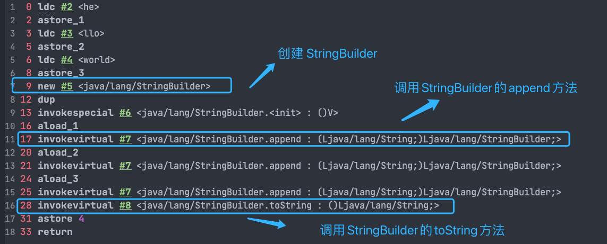
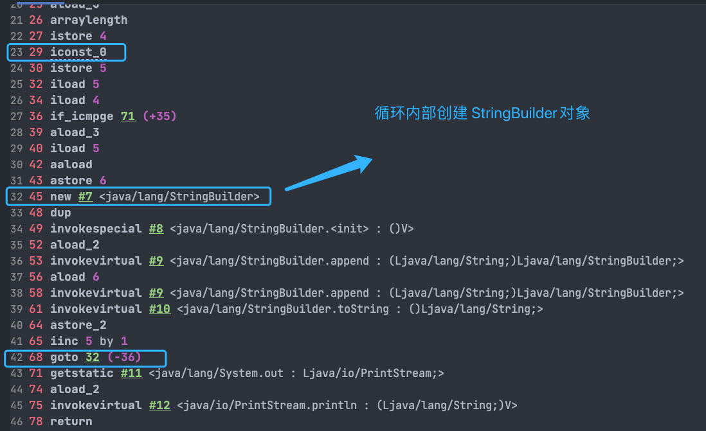
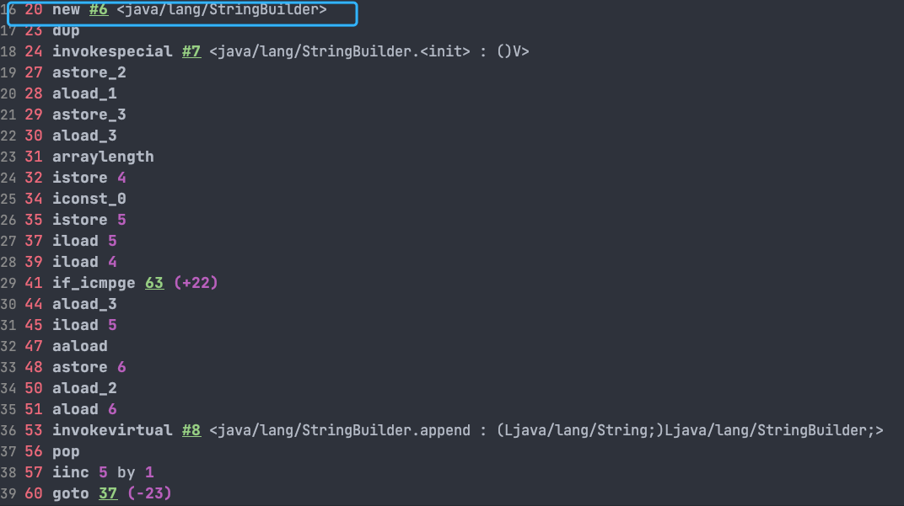

## String

### String、StringBuffer、StringBuilder 的区别？

**可变性**

`String` 是不可变的（后面会详细分析原因）。

`StringBuilder` 与 `StringBuffer` 都继承自 `AbstractStringBuilder` 类，在 `AbstractStringBuilder` 中也是使用字符数组保存字符串，不过没有使用 `final` 和 `private` 关键字修饰，最关键的是这个 `AbstractStringBuilder` 类还提供了很多修改字符串的方法比如 `append` 方法。

```java
abstract class AbstractStringBuilder implements Appendable, CharSequence {
    char[] value;
    public AbstractStringBuilder append(String str) {
        if (str == null)
            return appendNull();
        int len = str.length();
        ensureCapacityInternal(count + len);
        str.getChars(0, len, value, count);
        count += len;
        return this;
    }
    //...
}
```

**线程安全性**

`String` 中的对象是不可变的，也就可以理解为常量，线程安全。`AbstractStringBuilder` 是 `StringBuilder` 与 `StringBuffer` 的公共父类，定义了一些字符串的基本操作，如 `expandCapacity`、`append`、`insert`、`indexOf` 等公共方法。`StringBuffer` 对方法加了同步锁或者对调用的方法加了同步锁，所以是线程安全的。`StringBuilder` 并没有对方法进行加同步锁，所以是非线程安全的。

**性能**

每次对 `String` 类型进行改变的时候，都会生成一个新的 `String` 对象，然后将指针指向新的 `String` 对象。`StringBuffer` 每次都会对 `StringBuffer` 对象本身进行操作，而不是生成新的对象并改变对象引用。相同情况下使用 `StringBuilder` 相比使用 `StringBuffer` 仅能获得 10%~15% 左右的性能提升，但却要冒多线程不安全的风险。

**对于三者使用的总结：**

- 操作少量的数据: 适用 `String`
- 单线程操作字符串缓冲区下操作大量数据: 适用 `StringBuilder`
- 多线程操作字符串缓冲区下操作大量数据: 适用 `StringBuffer`

### String 为什么是不可变的?

```java
public final class String implements java.io.Serializable, Comparable<String>, CharSequence {
    private final char value[];
  //...
}
```

> 🐛 修正：我们知道被 `final` 关键字修饰的类不能被继承，修饰的方法不能被重写，修饰的变量是基本数据类型则值不能改变，修饰的变量是引用类型则不能再指向其他对象。因此，`final` 关键字修饰的数组保存字符串并不是 `String` 不可变的根本原因，因为这个数组保存的字符串是可变的（`final` 修饰引用类型变量的情况）。
>
> `String` 真正不可变有下面几点原因：
>
> 1. 保存字符串的数组被 `final` 修饰且为私有的，并且`String` 类没有提供/暴露修改这个字符串的方法。
> 2. `String` 类被 `final` 修饰导致其不能被继承，进而避免了子类破坏 `String` 不可变。
>
> 相关阅读：[如何理解 String 类型值的不可变？ - 知乎提问](https://www.zhihu.com/question/20618891/answer/114125846)
>
> 补充：在 Java 9 之后，`String`、`StringBuilder` 与 `StringBuffer` 的实现改用 `byte` 数组存储字符串。
>
> ```java
> public final class String implements java.io.Serializable,Comparable<String>, CharSequence {
>     // @Stable 注解表示变量最多被修改一次，称为“稳定的”。
>     @Stable
>     private final byte[] value;
> }
>
> abstract class AbstractStringBuilder implements Appendable, CharSequence {
>     byte[] value;
>
> }
> ```
>
> **Java 9 为何要将 `String` 的底层实现由 `char[]` 改成了 `byte[]` ?**
>
> 新版的 String 其实支持两个编码方案：Latin-1 和 UTF-16。如果字符串中包含的汉字没有超过 Latin-1 可表示范围内的字符，那就会使用 Latin-1 作为编码方案。Latin-1 编码方案下，`byte` 占一个字节(8 位)，`char` 占用 2 个字节（16），`byte` 相较 `char` 节省一半的内存空间。
>
> JDK 官方就说了绝大部分字符串对象只包含 Latin-1 可表示的字符。
>
> 如果字符串中包含的汉字超过 Latin-1 可表示范围内的字符，`byte` 和 `char` 所占用的空间是一样的。
>
> 这是官方的介绍：<https://openjdk.java.net/jeps/254> 。

### 字符串拼接用“+” 还是 StringBuilder?

Java 语言本身并不支持运算符重载，“+”和“+=”是专门为 String 类重载过的运算符，也是 Java 中仅有的两个重载过的运算符。

```java
String str1 = "he";
String str2 = "llo";
String str3 = "world";
String str4 = str1 + str2 + str3;
```

上面的代码对应的字节码如下：



可以看出，字符串对象通过“+”的字符串拼接方式，实际上是通过 `StringBuilder` 调用 `append()` 方法实现的，拼接完成之后调用 `toString()` 得到一个 `String` 对象 。

不过，在循环内使用“+”进行字符串的拼接的话，存在比较明显的缺陷：**编译器不会创建单个 `StringBuilder` 以复用，会导致创建过多的 `StringBuilder` 对象**。

```java
String[] arr = {"he", "llo", "world"};
String s = "";
for (int i = 0; i < arr.length; i++) {
    s += arr[i];
}
System.out.println(s);
```

`StringBuilder` 对象是在循环内部被创建的，这意味着每循环一次就会创建一个 `StringBuilder` 对象。



如果直接使用 `StringBuilder` 对象进行字符串拼接的话，就不会存在这个问题了。

```java
String[] arr = {"he", "llo", "world"};
StringBuilder s = new StringBuilder();
for (String value : arr) {
    s.append(value);
}
System.out.println(s);
```



如果你使用 IDEA 的话，IDEA 自带的代码检查机制也会提示你修改代码。

在 JDK 9 中，字符串相加“+”改为用动态方法 `makeConcatWithConstants()` 来实现，通过提前分配空间从而减少了部分临时对象的创建。然而这种优化主要针对简单的字符串拼接，如： `a+b+c` 。对于循环中的大量拼接操作，仍然会逐个动态分配内存（类似于两个两个 append 的概念），并不如手动使用 StringBuilder 来进行拼接效率高。这个改进是 JDK9 的 [JEP 280](https://openjdk.org/jeps/280) 提出的，关于这部分改进的详细介绍，推荐阅读这篇文章：还在无脑用 [StringBuilder？来重温一下字符串拼接吧](https://juejin.cn/post/7182872058743750715) 以及参考 [issue#2442](https://github.com/Snailclimb/JavaGuide/issues/2442)。

### String#equals() 和 Object#equals() 有何区别？

`String` 中的 `equals` 方法是被重写过的，比较的是 String 字符串的值是否相等。 `Object` 的 `equals` 方法是比较的对象的内存地址。

### 字符串常量池的作用了解吗？

**字符串常量池** 是 JVM 为了提升性能和减少内存消耗针对字符串（String 类）专门开辟的一块区域，主要目的是为了避免字符串的重复创建。

```java
// 在字符串常量池中创建字符串对象 ”ab“
// 将字符串对象 ”ab“ 的引用赋值给 aa
String aa = "ab";
// 直接返回字符串常量池中字符串对象 ”ab“，赋值给引用 bb
String bb = "ab";
System.out.println(aa==bb); // true
```

更多关于字符串常量池的介绍可以看一下 [Java 内存区域详解](https://javaguide.cn/java/jvm/memory-area.html) 这篇文章。

### String s1 = new String("abc");这句话创建了几个字符串对象？

先说答案：会创建 1 或 2 个字符串对象。

1. 字符串常量池中不存在 "abc"：会创建 2 个 字符串对象。一个在字符串常量池中，由 `ldc` 指令触发创建。一个在堆中，由 `new String()` 创建，并使用常量池中的 "abc" 进行初始化。
2. 字符串常量池中已存在 "abc"：会创建 1 个 字符串对象。该对象在堆中，由 `new String()` 创建，并使用常量池中的 "abc" 进行初始化。

下面开始详细分析。

1、如果字符串常量池中不存在字符串对象 “abc”，那么它首先会在字符串常量池中创建字符串对象 "abc"，然后在堆内存中再创建其中一个字符串对象 "abc"。

示例代码（JDK 1.8）：

```java
String s1 = new String("abc");
```

对应的字节码：

```java
// 在堆内存中分配一个尚未初始化的 String 对象。
// #2 是常量池中的一个符号引用，指向 java/lang/String 类。
// 在类加载的解析阶段，这个符号引用会被解析成直接引用，即指向实际的 java/lang/String 类。
0 new #2 <java/lang/String>
// 复制栈顶的 String 对象引用，为后续的构造函数调用做准备。
// 此时操作数栈中有两个相同的对象引用：一个用于传递给构造函数，另一个用于保持对新对象的引用，后续将其存储到局部变量表。
3 dup
// JVM 先检查字符串常量池中是否存在 "abc"。
// 如果常量池中已存在 "abc"，则直接返回该字符串的引用；
// 如果常量池中不存在 "abc"，则 JVM 会在常量池中创建该字符串字面量并返回它的引用。
// 这个引用被压入操作数栈，用作构造函数的参数。
4 ldc #3 <abc>
// 调用构造方法，使用从常量池中加载的 "abc" 初始化堆中的 String 对象
// 新的 String 对象将包含与常量池中的 "abc" 相同的内容，但它是一个独立的对象，存储于堆中。
6 invokespecial #4 <java/lang/String.<init> : (Ljava/lang/String;)V>
// 将堆中的 String 对象引用存储到局部变量表
9 astore_1
// 返回，结束方法
10 return
```

`ldc (load constant)` 指令的确是从常量池中加载各种类型的常量，包括字符串常量、整数常量、浮点数常量，甚至类引用等。对于字符串常量，`ldc` 指令的行为如下：

1. **从常量池加载字符串**：`ldc` 首先检查字符串常量池中是否已经有内容相同的字符串对象。
2. **复用已有字符串对象**：如果字符串常量池中已经存在内容相同的字符串对象，`ldc` 会将该对象的引用加载到操作数栈上。
3. **没有则创建新对象并加入常量池**：如果字符串常量池中没有相同内容的字符串对象，JVM 会在常量池中创建一个新的字符串对象，并将其引用加载到操作数栈中。

2、如果字符串常量池中已存在字符串对象“abc”，则只会在堆中创建 1 个字符串对象“abc”。

示例代码（JDK 1.8）：

```java
// 字符串常量池中已存在字符串对象“abc”
String s1 = "abc";
// 下面这段代码只会在堆中创建 1 个字符串对象“abc”
String s2 = new String("abc");
```

对应的字节码：

```java
0 ldc #2 <abc>
2 astore_1
3 new #3 <java/lang/String>
6 dup
7 ldc #2 <abc>
9 invokespecial #4 <java/lang/String.<init> : (Ljava/lang/String;)V>
12 astore_2
13 return
```

这里就不对上面的字节码进行详细注释了，7 这个位置的 `ldc` 命令不会在堆中创建新的字符串对象“abc”，这是因为 0 这个位置已经执行了一次 `ldc` 命令，已经在堆中创建过一次字符串对象“abc”了。7 这个位置执行 `ldc` 命令会直接返回字符串常量池中字符串对象“abc”对应的引用。

### String#intern 方法有什么作用?

`String.intern()` 是一个 `native` (本地) 方法，用来处理字符串常量池中的字符串对象引用。它的工作流程可以概括为以下两种情况：

1. **常量池中已有相同内容的字符串对象**：如果字符串常量池中已经有一个与调用 `intern()` 方法的字符串内容相同的 `String` 对象，`intern()` 方法会直接返回常量池中该对象的引用。
2. **常量池中没有相同内容的字符串对象**：如果字符串常量池中还没有一个与调用 `intern()` 方法的字符串内容相同的对象，`intern()` 方法会将当前字符串对象的引用添加到字符串常量池中，并返回该引用。

总结：

- `intern()` 方法的主要作用是确保字符串引用在常量池中的唯一性。
- 当调用 `intern()` 时，如果常量池中已经存在相同内容的字符串，则返回常量池中已有对象的引用；否则，将该字符串添加到常量池并返回其引用。

示例代码（JDK 1.8） :

```java
// s1 指向字符串常量池中的 "Java" 对象
String s1 = "Java";
// s2 也指向字符串常量池中的 "Java" 对象，和 s1 是同一个对象
String s2 = s1.intern();
// 在堆中创建一个新的 "Java" 对象，s3 指向它
String s3 = new String("Java");
// s4 指向字符串常量池中的 "Java" 对象，和 s1 是同一个对象
String s4 = s3.intern();
// s1 和 s2 指向的是同一个常量池中的对象
System.out.println(s1 == s2); // true
// s3 指向堆中的对象，s4 指向常量池中的对象，所以不同
System.out.println(s3 == s4); // false
// s1 和 s4 都指向常量池中的同一个对象
System.out.println(s1 == s4); // true
```

### String 类型的变量和常量做“+”运算时发生了什么？

先来看字符串不加 `final` 关键字拼接的情况（JDK1.8）：

```java
String str1 = "str";
String str2 = "ing";
String str3 = "str" + "ing";
String str4 = str1 + str2;
String str5 = "string";
System.out.println(str3 == str4);//false
System.out.println(str3 == str5);//true
System.out.println(str4 == str5);//false
```

> **注意**：比较 String 字符串的值是否相等，可以使用 `equals()` 方法。 `String` 中的 `equals` 方法是被重写过的。 `Object` 的 `equals` 方法是比较的对象的内存地址，而 `String` 的 `equals` 方法比较的是字符串的值是否相等。如果你使用 `==` 比较两个字符串是否相等的话，IDEA 还是提示你使用 `equals()` 方法替换。

**对于编译期可以确定值的字符串，也就是常量字符串 ，jvm 会将其存入字符串常量池。并且，字符串常量拼接得到的字符串常量在编译阶段就已经被存放字符串常量池，这个得益于编译器的优化。**

在编译过程中，Javac 编译器（下文中统称为编译器）会进行一个叫做 **常量折叠(Constant Folding)** 的代码优化。《深入理解 Java 虚拟机》中是也有介绍到：


常量折叠会把常量表达式的值求出来作为常量嵌在最终生成的代码中，这是 Javac 编译器会对源代码做的极少量优化措施之一(代码优化几乎都在即时编译器中进行)。

对于 `String str3 = "str" + "ing";` 编译器会给你优化成 `String str3 = "string";` 。

并不是所有的常量都会进行折叠，只有编译器在程序编译期就可以确定值的常量才可以：

- 基本数据类型( `byte`、`boolean`、`short`、`char`、`int`、`float`、`long`、`double`)以及字符串常量。
- `final` 修饰的基本数据类型和字符串变量
- 字符串通过 “+”拼接得到的字符串、基本数据类型之间算数运算（加减乘除）、基本数据类型的位运算（<<、\>>、\>>> ）

**引用的值在程序编译期是无法确定的，编译器无法对其进行优化。**

对象引用和“+”的字符串拼接方式，实际上是通过 `StringBuilder` 调用 `append()` 方法实现的，拼接完成之后调用 `toString()` 得到一个 `String` 对象 。

```java
String str4 = new StringBuilder().append(str1).append(str2).toString();
```

我们在平时写代码的时候，尽量避免多个字符串对象拼接，因为这样会重新创建对象。如果需要改变字符串的话，可以使用 `StringBuilder` 或者 `StringBuffer`。

不过，字符串使用 `final` 关键字声明之后，可以让编译器当做常量来处理。

示例代码：

```java
final String str1 = "str";
final String str2 = "ing";
// 下面两个表达式其实是等价的
String c = "str" + "ing";// 常量池中的对象
String d = str1 + str2; // 常量池中的对象
System.out.println(c == d);// true
```

被 `final` 关键字修饰之后的 `String` 会被编译器当做常量来处理，编译器在程序编译期就可以确定它的值，其效果就相当于访问常量。

如果 ，编译器在运行时才能知道其确切值的话，就无法对其优化。

示例代码（`str2` 在运行时才能确定其值）：

```java
final String str1 = "str";
final String str2 = getStr();
String c = "str" + "ing";// 常量池中的对象
String d = str1 + str2; // 在堆上创建的新的对象
System.out.println(c == d);// false
public static String getStr() {
      return "ing";
}
```

## 参考

- 深入解析 String#intern：<https://tech.meituan.com/2014/03/06/in-depth-understanding-string-intern.html>
- Java String 源码解读：<http://keaper.cn/2020/09/08/java-string-mian-mian-guan/>
- R 大（RednaxelaFX）关于常量折叠的回答：<https://www.zhihu.com/question/55976094/answer/147302764>
