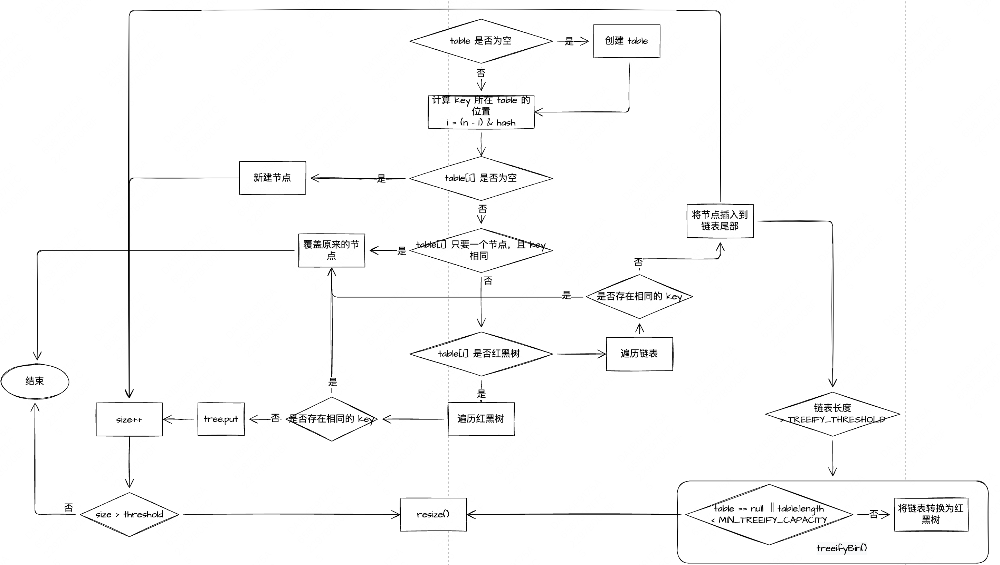
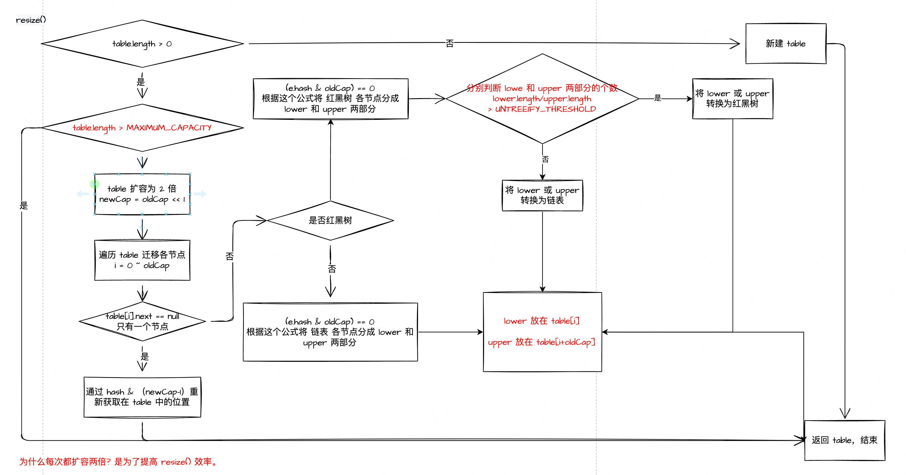
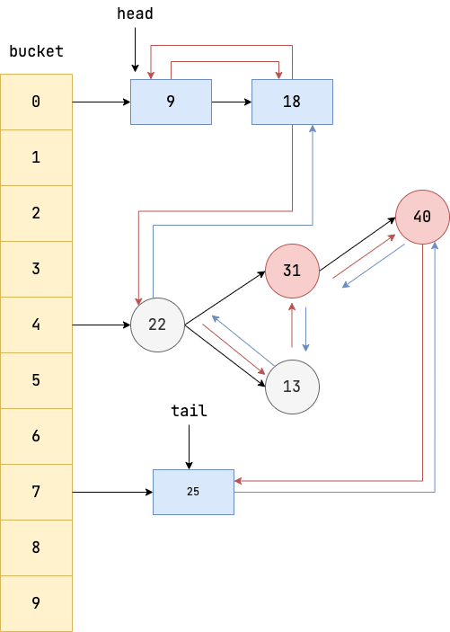
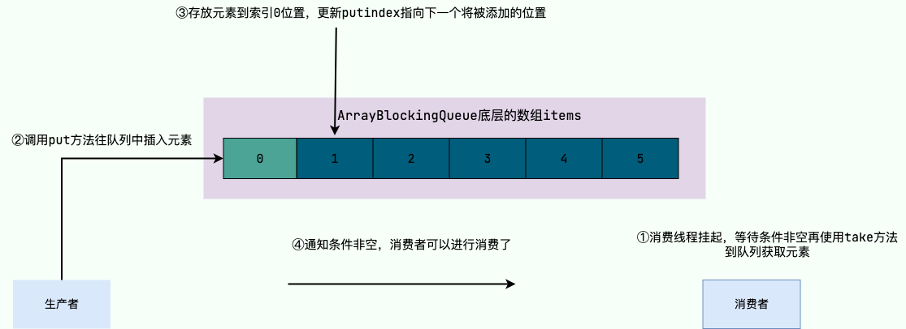
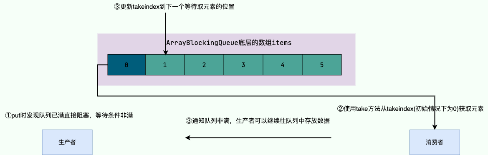
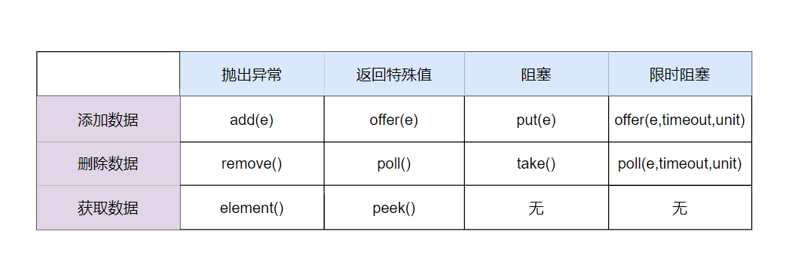

# 集合

## Arraylist 与 LinkedList 区别?

- **是否保证线程安全：** `ArrayList` 和 `LinkedList` 都是不保证线程安全；
- **底层数据结构：** `ArrayList` 底层使用的是 **`Object[]` 数组**；`LinkedList` 底层使用的是 **双向链表** 数据结构（JDK1.6 之前为循环链表，JDK1.7 取消了循环。注意双向链表和双向循环链表的区别，下面有介绍到！）
- **插入和删除是否受元素位置的影响：**
  - `ArrayList` 采用数组存储，所以插入和删除元素的时间复杂度受元素位置的影响。 比如：执行`add(E e)`方法的时候， `ArrayList` 会默认在将指定的元素追加到此列表的末尾，这种情况时间复杂度就是 O(1)。但是如果要在指定位置 i 插入和删除元素的话（`add(int index, E element)`），时间复杂度就为 O(n)。因为在进行上述操作的时候集合中第 i 和第 i 个元素之后的(n-i)个元素都要执行向后位/向前移一位的操作。
  - `LinkedList` 采用链表存储，所以在头尾插入或者删除元素不受元素位置的影响（`add(E e)`、`addFirst(E e)`、`addLast(E e)`、`removeFirst()`、 `removeLast()`），时间复杂度为 O(1)，如果是要在指定位置 `i` 插入和删除元素的话（`add(int index, E element)`，`remove(Object o)`,`remove(int index)`）， 时间复杂度为 O(n) ，因为需要先移动到指定位置再插入和删除。
- **是否支持快速随机访问：** `LinkedList` 不支持高效的随机元素访问，而 `ArrayList`（实现了 `RandomAccess` 接口） 支持。快速随机访问就是通过元素的序号快速获取元素对象(对应于`get(int index)`方法)。
- **内存空间占用：** `ArrayList` 的空间浪费主要体现在在 list 列表的结尾会预留一定的容量空间，而 LinkedList 的空间花费则体现在它的每一个元素都需要消耗比 ArrayList 更多的空间（因为要存放直接后继和直接前驱以及数据）。
- 不要下意识地认为 `LinkedList` 作为链表就最适合元素增删的场景，`LinkedList` 仅仅在头尾插入或者删除元素的时候时间复杂度近似 O(1)，其他情况增删元素的平均时间复杂度都是 O(n) 。

## Arraylist 扩容机制

- 默认数组大小是 10, 最大不超过 int MAX_ARRAY_SIZE = Integer.MAX_VALUE - 8;
- 每次扩容为原来的 1.5 倍左右（oldCapacity 为偶数就是 1.5 倍，否则是 1.5 倍左右），int newCapacity = oldCapacity + (oldCapacity >> 1);
- 调用 void ensureCapacity(int minCapacity) 、  boolean add(E e) 、void add(int index, E element) 方法会触发扩容 


## HashMap 

```Java
    /**
     * The default initial capacity - MUST be a power of two.
     * 默认的初始容量 - 这个值必须是2的整数次幂。
     */
    static final int DEFAULT_INITIAL_CAPACITY = 1 << 4; // aka 16

    /**
     * The maximum capacity, used if a higher value is implicitly specified
     * by either of the constructors with arguments.
     * MUST be a power of two <= 1<<30.
     * 最大容量
     * 如果通过带参数的构造函数隐式地指定了一个更大的值，那么就会使用这个值。这个值必须是2的整数次幂，且小于等于 1<<30。
     */
    static final int MAXIMUM_CAPACITY = 1 << 30;

    /**
     * The load factor used when none specified in constructor.
     * 默认负载因子
     */
    static final float DEFAULT_LOAD_FACTOR = 0.75f;

    /**
     * The bin count threshold for using a tree rather than list for a
     * bin.  Bins are converted to trees when adding an element to a
     * bin with at least this many nodes. The value must be greater
     * than 2 and should be at least 8 to mesh with assumptions in
     * tree removal about conversion back to plain bins upon
     * shrinkage.
     * 
     * 链表转换为红黑树的节点数阈值
     */
    static final int TREEIFY_THRESHOLD = 8;

    /**
     * The bin count threshold for untreeifying a (split) bin during a
     * resize operation. Should be less than TREEIFY_THRESHOLD, and at
     * most 6 to mesh with shrinkage detection under removal.
     *
     * 红黑树恢复为链表的节点数阈值。
     */
    static final int UNTREEIFY_THRESHOLD = 6;
    /**
     * The smallest table capacity for which bins may be treeified.
     * (Otherwise the table is resized if too many nodes in a bin.)
     * Should be at least 4 * TREEIFY_THRESHOLD to avoid conflicts
     * between resizing and treeification thresholds.
     * 允许转换为红黑树的 table 最小容量
     */
    static final int MIN_TREEIFY_CAPACITY = 64;

    // 哈希表，首次使用时初始化，并根据需要调整大小。分配时，长度始终是 2 的幂。
    transient Node<K,V>[] table;

    transient Set<Map.Entry<K,V>> entrySet;

    // The number of key-value mappings contained in this map.
    // Map 中键值对的数量
    transient int size;

    // The next size value at which to resize (capacity * load factor).
    // 下一次进行扩容的大小 (容量 * 负载因子) 
    int threshold;

    static final int hash(Object key) {
      int h;
      return (key == null) ? 0 : (h = key.hashCode()) ^ (h >>> 16);
    }

```

- `HashMap` **是非线程安全的**，默认的初始化大小为 16。之后每次扩充，容量变为原来的 2 倍。并且， `HashMap` 总是使用 2 的幂作为哈希表的大小。
- `HashMap`由**数组+链表（红黑树）**组成的，数组是 HashMap 的主体，链表（红黑树）则是主要为了解决哈希冲突而存在的（“拉链法”解决冲突）。
- JDK1.8 以后的 `HashMap` 在解决哈希冲突时有了较大的变化，当链表长度大于等于阈值（默认为 8）时，将链表转化为红黑树，以减少搜索时间。只有当数组长度大于或者等于 64 的情况下，才会执行转换红黑树操作，以减少搜索时间。否则，就是只是执行 `resize()` 方法对数组扩容。

**为什么HashMap每次扩容扩容为原来的 2 倍

- 进行扩容，会伴随着一次重新 hash 分配，遍历 hash 表中所有的元素并将其放置在新 table 对应位置的链表或红黑树中，整个过程是比较耗时的。为了降低这个阶段的耗时，table 扩容每次扩容为原来的两倍，并且 table 的长度始终是 2 的倍数
- 假设原 table 长度是 oldCap，则新 table 长度是 newCap = oldCap << 1
- 元素查找其在新 table 中位置的计算是： e.hash & (newCap - 1)，按位运算 newCap - 1 和 oldCap - 1 只有最左边的一位不一样，所以 e.hash & (newCap - 1) 与 e.hash & (oldCap - 1) 只有 50% 的概率不一样，所以从概率角度说只有 50% 的元素需要重新分配到新位置。

**添加元素 put()**


**数组扩容 resize()**



## ConcurrentHashMap 

```Java
    // HashMap 介绍的参数在 ConcurrentHashMap 中有相同的含义

    /**
     * 哈希表的初始化和扩容控制字段。
     * 
     * 负值情况：
     * - -1: 表示正在初始化
     * - -(1 + n): 表示有n个线程正在进行扩容操作
     * 
     * 正值情况：
     * - 当 table 为 null 时：
     * -- 0: 代表使用默认初始容量
     * -- 正数: 代表使用指定的初始容量
     * - 初始化后：表示下一次需要扩容的元素数量阈值  
     */
    private transient volatile int sizeCtl;

    static final int MOVED     = -1; // hash for forwarding nodes
    static final int TREEBIN   = -2; // hash for roots of trees
    static final int RESERVED  = -3; // hash for transient reservations
    static final int HASH_BITS = 0x7fffffff; // usable bits of normal node hash

    /**
     * 将哈希值的高位通过 XOR 运算扩展到低位
     * 强制将最高位设置为 0
     * 优化哈希值在表中的分布
     **/
    static final int spread(int h) {
        return (h ^ (h >>> 16)) & HASH_BITS;
    }

```

- Java7 中 `ConcurrentHashMap` 使用的分段锁，也就是每一个 Segment 上同时只有一个线程可以操作，每一个 `Segment` 都是一个类似 `HashMap` 数组的结构，它可以扩容，它的冲突会转化为链表。但是 `Segment` 的个数一但初始化就不能改变。
- Java8 中的 `ConcurrentHashMap` 使用的 `Synchronized` 锁加 CAS 的机制。结构也由 Java7 中的 **`Segment` 数组 + `HashEntry` 数组 + 链表** 进化成了 **Node 数组 + 链表 / 红黑树**，Node 是类似于一个 HashEntry 的结构。它的冲突再达到一定大小时会转化成红黑树，在冲突小于一定数量时又退回链表。

**添加元素 put()**

1. 根据 key 计算出 hashcode。
2. 判断是否需要进行初始化。
3. 即为当前 key 定位出的 Node，如果为空表示当前位置可以写入数据，利用 CAS 尝试写入，失败则自旋保证成功。
4. 如果当前位置的 `hashcode == MOVED == -1`,则需要进行扩容。
5. 如果都不满足，则利用 synchronized 锁写入数据。
6. 如果数量大于 `TREEIFY_THRESHOLD` 则要执行树化方法，在 `treeifyBin` 中会首先判断当前数组长度 ≥64 时才会将链表转换为红黑树。

**获取元素 get()**

1. 根据 hash 值计算位置。
2. 查找到指定位置，如果头节点就是要找的，直接返回它的 value.
3. 如果头节点 hash 值小于 0 ，说明正在扩容或者是红黑树，查找之。
4. 如果是链表，遍历查找之。

## LinkedHashMap

```Java 
public class LinkedHashMap<K,V>
    extends HashMap<K,V>
    implements Map<K,V>
{
  ...

    /**
     * 用于决定是否需要移除最老的元素。主要用于实现缓存等需要限制大小的场景。
     * 核心功能
     * - 该方法在每次执行 put 或 putAll 操作后被调用
     * - 返回 true 表示需要移除最老的元素，false 表示保留
     * - 默认实现返回 false，即默认行为是保留所有元素
     * 
     * 使用场景
     * - 实现缓存功能
     * - 控制 Map 容量
     * - 自动清理旧数据
     **/
    protected boolean removeEldestEntry(Map.Entry<K,V> eldest) {
        return false;
    }

  ...

}
```


- 支持遍历时会按照插入顺序有序进行迭代。
- 支持按照元素访问顺序排序,适用于封装 LRU（Least Recently Used) 缓存工具。
- 因为内部使用双向链表维护各个节点，所以遍历时的效率和元素个数成正比，相较于和容量成正比的 HashMap 来说，迭代效率会高很多。

## CopyOnWriteArrayList

- `CopyOnWriteArrayList` 线程安全的核心在于其采用了 **写时复制（Copy-On-Write）** 的策略，写时复制机制非常**适合读多写少的并发场景**，能够极大地提高系统的并发性能。
- 写入时复制（英语：Copy-on-write，简称 COW）是一种计算机程序设计领域的优化策略。其核心思想是，如果有多个调用者（callers）同时请求相同资源（如内存或磁盘上的数据存储），他们会共同获取相同的指针指向相同的资源，直到某个调用者试图修改资源的内容时，系统才会真正复制一份专用副本（private copy）给该调用者，而其他调用者所见到的最初的资源仍然保持不变。这过程对其他的调用者都是透明的。此作法主要的优点是如果调用者没有修改该资源，就不会有副本（private copy）被创建，因此多个调用者只是读取操作时可以共享同一份资源。

**缺点**

1. 内存占用：每次写操作都需要复制一份原始数据，会占用额外的内存空间，在数据量比较大的情况下，可能会导致内存资源不足。
2. 写操作开销：每一次写操作都需要复制一份原始数据，然后再进行修改和替换，所以写操作的开销相对较大，在写入比较频繁的场景下，性能可能会受到影响。
3. 数据一致性问题：修改操作不会立即反映到最终结果中，还需要等待复制完成，这可能会导致一定的数据一致性问题。

## 阻塞队列

阻塞队列就是典型的生产者-消费者模型，它可以做到以下几点:

1. 当阻塞队列数据为空时，所有的消费者线程都会被阻塞，等待队列非空。
2. 当生产者往队列里填充数据后，队列就会通知消费者队列非空，消费者此时就可以进来消费。
3. 当阻塞队列因为消费者消费过慢或者生产者存放元素过快导致队列填满时无法容纳新元素时，生产者就会被阻塞，等待队列非满时继续存放元素。
4. 当消费者从队列中消费一个元素之后，队列就会通知生产者队列非满，生产者可以继续填充数据了。

## ArrayBlockingQueue

### ArrayBlockingQueue 是什么？它的特点是什么？

`ArrayBlockingQueue` 是 `BlockingQueue` 接口的有界队列实现类，常用于多线程之间的数据共享，底层采用数组实现，从其名字就能看出来了。

`ArrayBlockingQueue` 的容量有限，一旦创建，容量不能改变。

为了保证线程安全，`ArrayBlockingQueue` 的并发控制采用可重入锁 `ReentrantLock` ，不管是插入操作还是读取操作，都需要获取到锁才能进行操作。并且，它还支持公平和非公平两种方式的锁访问机制，默认是非公平锁。

`ArrayBlockingQueue` 虽名为阻塞队列，但也支持非阻塞获取和新增元素（例如 `poll()` 和 `offer(E e)` 方法），只是队列满时添加元素会抛出异常，队列为空时获取的元素为 null，一般不会使用。

### ArrayBlockingQueue 和 LinkedBlockingQueue 有什么区别？

`ArrayBlockingQueue` 和 `LinkedBlockingQueue` 是 Java 并发包中常用的两种阻塞队列实现，它们都是线程安全的。不过，不过它们之间也存在下面这些区别：

- 底层实现：`ArrayBlockingQueue` 基于数组实现，而 `LinkedBlockingQueue` 基于链表实现。
- 是否有界：`ArrayBlockingQueue` 是有界队列，必须在创建时指定容量大小。`LinkedBlockingQueue` 创建时可以不指定容量大小，默认是`Integer.MAX_VALUE`，也就是无界的。但也可以指定队列大小，从而成为有界的。
- 锁是否分离： `ArrayBlockingQueue`中的锁是没有分离的，即生产和消费用的是同一个锁；`LinkedBlockingQueue`中的锁是分离的，即生产用的是`putLock`，消费是`takeLock`，这样可以防止生产者和消费者线程之间的锁争夺。
- 内存占用：`ArrayBlockingQueue` 需要提前分配数组内存，而 `LinkedBlockingQueue` 则是动态分配链表节点内存。这意味着，`ArrayBlockingQueue` 在创建时就会占用一定的内存空间，且往往申请的内存比实际所用的内存更大，而`LinkedBlockingQueue` 则是根据元素的增加而逐渐占用内存空间。

### ArrayBlockingQueue 和 ConcurrentLinkedQueue 有什么区别？

`ArrayBlockingQueue` 和 `ConcurrentLinkedQueue` 是 Java 并发包中常用的两种队列实现，它们都是线程安全的。不过，不过它们之间也存在下面这些区别：

- 底层实现：`ArrayBlockingQueue` 基于数组实现，而 `ConcurrentLinkedQueue` 基于链表实现。
- 是否有界：`ArrayBlockingQueue` 是有界队列，必须在创建时指定容量大小，而 `ConcurrentLinkedQueue` 是无界队列，可以动态地增加容量。
- 是否阻塞：`ArrayBlockingQueue` 支持阻塞和非阻塞两种获取和新增元素的方式（一般只会使用前者）， `ConcurrentLinkedQueue` 是无界的，仅支持非阻塞式获取和新增元素。

### ArrayBlockingQueue 的实现原理是什么？

```Java
public class ArrayBlockingQueue<E> extends AbstractQueue<E>
        implements BlockingQueue<E>, java.io.Serializable {

    /** The queued items */
    final Object[] items;

    /** items index for next take, poll, peek or remove */
    int takeIndex;

    /** items index for next put, offer, or add */
    int putIndex;

    /** Number of elements in the queue */
    int count;

    /** Main lock guarding all access */
    final ReentrantLock lock;

    /** Condition for waiting takes */
    private final Condition notEmpty;

    /** Condition for waiting puts */
    private final Condition notFull;

    ...

}
```

`ArrayBlockingQueue` 的实现原理主要分为以下几点（这里以阻塞式获取和新增元素为例介绍）：

- `ArrayBlockingQueue` 内部维护一个定长的数组用于存储元素。
- 通过使用 `ReentrantLock` 锁对象对读写操作进行同步，即通过锁机制来实现线程安全。
- 通过 `Condition` 实现线程间的等待和唤醒操作。

这里再详细介绍一下线程间的等待和唤醒具体的实现：

- 当队列已满时，生产者线程会调用 `notFull.await()` 方法让生产者进行等待，等待队列非满时插入（非满条件）。
- 当队列为空时，消费者线程会调用 `notEmpty.await()`方法让消费者进行等待，等待队列非空时消费（非空条件）。
- 当有新的元素被添加时，生产者线程会调用 `notEmpty.signal()`方法唤醒正在等待消费的消费者线程。
- 当队列中有元素被取出时，消费者线程会调用 `notFull.signal()`方法唤醒正在等待插入元素的生产者线程。






> 关于 `Condition`接口的补充：
> 
> `Condition`是 JDK1.5 之后才有的，它具有很好的灵活性，比如可以实现多路通知功能也就是在一个`Lock`对象中可以创建多个`Condition`实例（即对象监视器），**线程对象可以注册在指定的`Condition`中，从而可以有选择性的进行线程通知，在调度线程上更加灵活。 在使用`notify()/notifyAll()`方法进行通知时，被通知的线程是由 JVM 选择的，用`ReentrantLock`类结合`Condition`实例可以实现“选择性通知”** ，这个功能非常重要，而且是 `Condition` 接口默认提供的。而`synchronized`关键字就相当于整个 `Lock` 对象中只有一个`Condition`实例，所有的线程都注册在它一个身上。如果执行`notifyAll()`方法的话就会通知所有处于等待状态的线程，这样会造成很大的效率问题。而`Condition`实例的`signalAll()`方法，只会唤醒注册在该`Condition`实例中的所有等待线程。




## 集合源码分析

- [ArrayList](/docs/Java/collection/arraylist-source-code.md)
- [LinkedList](/docs/Java/collection/linkedlist-source-code.md)
- [HashMap](/docs/Java/collection/hashmap-source-code.md)
- [ConcurrentHashMap](/docs/Java/collection/concurrent-hash-map-source-code.md)
- [LinkedHashMap](/docs/Java/collection/linkedhashmap-source-code.md)
- [CopyOnWriteArrayList](/docs/Java/collection/copyonwritearraylist-source-code.md)
- [ArrayBlockingQueue](/docs/Java/collection/arrayblockingqueue-source-code.md)
- [PriorityQueue](/docs/alg/Tree/Heap.md)
- [DelayQueue](/docs/Java/collection/delayqueue-source-code.md)