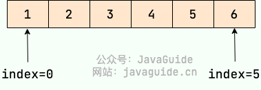

# 数组

**数组（Array）** 是一种很常见的数据结构。它由相同类型的元素（element）组成，并且是使用一块连续的内存来存储。

我们直接可以利用元素的索引（index）可以计算出该元素对应的存储地址。

数组的特点是：**提供随机访问** 并且容量有限。

```java
假如数组的长度为 n。
访问：O（1）//访问特定位置的元素
插入：O（n ）//最坏的情况发生在插入发生在数组的首部并需要移动所有元素时
删除：O（n）//最坏的情况发生在删除数组的开头发生并需要移动第一元素后面所有的元素时
```


