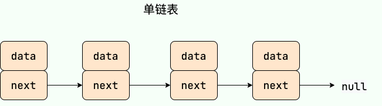
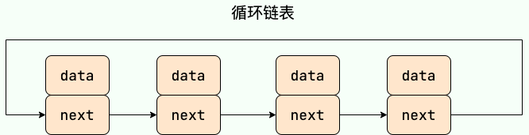
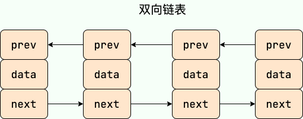

# 链表

## 链表简介

**链表（LinkedList）** 虽然是一种线性表，但是并不会按线性的顺序存储数据，使用的不是连续的内存空间来存储数据。

链表的插入和删除操作的复杂度为 O(1) ，只需要知道目标位置元素的上一个元素即可。但是，在查找一个节点或者访问特定位置的节点的时候复杂度为 O(n) 。

使用链表结构可以克服数组需要预先知道数据大小的缺点，链表结构可以充分利用计算机内存空间,实现灵活的内存动态管理。但链表不会节省空间，相比于数组会占用更多的空间，因为链表中每个节点存放的还有指向其他节点的指针。除此之外，链表不具有数组随机读取的优点。

## 链表分类

**常见链表分类：**

1. 单链表
2. 双向链表
3. 循环链表
4. 双向循环链表

```java
假如链表中有n个元素。
访问：O（n）//访问特定位置的元素
插入删除：O（1）//必须要要知道插入元素的位置
```

### 单链表

**单链表** 单向链表只有一个方向，结点只有一个后继指针 next 指向后面的节点。因此，链表这种数据结构通常在物理内存上是不连续的。我们习惯性地把第一个结点叫作头结点，链表通常有一个不保存任何值的 head 节点(头结点)，通过头结点我们可以遍历整个链表。尾结点通常指向 null。



### 循环链表

**循环链表** 其实是一种特殊的单链表，和单链表不同的是循环链表的尾结点不是指向 null，而是指向链表的头结点。



### 双向链表

**双向链表** 包含两个指针，一个 prev 指向前一个节点，一个 next 指向后一个节点。



### 双向循环链表

**双向循环链表** 最后一个节点的 next 指向 head，而 head 的 prev 指向最后一个节点，构成一个环。


## 应用场景

- 如果需要支持随机访问的话，链表没办法做到。
- 如果需要存储的数据元素的个数不确定，并且需要经常添加和删除数据的话，使用链表比较合适。
- 如果需要存储的数据元素的个数确定，并且不需要经常添加和删除数据的话，使用数组比较合适。

## 数组 vs 链表

- 数组支持随机访问，而链表不支持。
- 数组使用的是连续内存空间对 CPU 的缓存机制友好，链表则相反。
- 数组的大小固定，而链表则天然支持动态扩容。如果声明的数组过小，需要另外申请一个更大的内存空间存放数组元素，然后将原数组拷贝进去，这个操作是比较耗时的！

## 链表基本操作 Code001

- 翻转单链表
- 翻转双链表
- 随机生成单链表
- 随机生成多链表

## 获取链表的中间节点 Code002

- 奇数长度返回中点，偶数长度返回上中点
- 奇数长度返回中点，偶数长度返回下中点
- 奇数长度返回中点前一个，偶数长度返回上中点前一个
- 奇数长度返回中点前一个，偶数长度返回下中点前一个

## 判断单链表是否为回文结构 Code003

- 方法一：使用 stack，额外空间复杂度 O(N)
- 方法二：快慢指针 + stack ，额外空间复杂度 O(N/2)
- 方法三：快慢指针找到中间点，中间点后面的反转，判断后再反转回去， ，额外空间复杂度 O(1)

## 包含 rand 指针的链表复制 Code004

一种特殊的单链表节点类描述如下 class Node { int value; Node next; Node rand; Node(int val) { value = val; } }
rand指针是单链表节点结构中新增的指针，rand可能指向链表中的任意一个节点，也可能指向null 给定一个由Node节点类型组成的无环单链表的头节点head，请实现一个函数完成这个链表的复制 返回复制的新链表的头节点，要求时间复杂度O(
N)，额外空间复杂度O(1)

## 链表荷兰国旗问题 Code005

给定一个单链表的头节点head，给定一个整数n，将链表按n划分成左边<n、中间==n、右边>n

## 链表相交、是否有环问题 Code006

给定两个可能有环也可能无环的单链表，头节点head1和head2 请实现一个函数，如果两个链表相交，请返回相交的第一个节点。如果不相交返回null 要求如果两个链表长度之和为N，时间复杂度请达到O(N)，额外空间复杂度请达到O(1)

