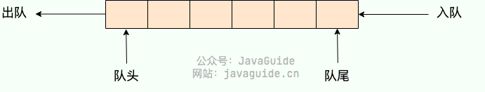
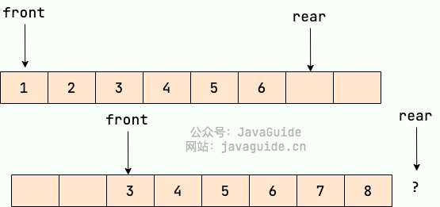
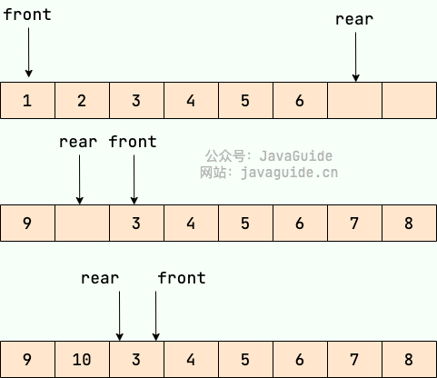
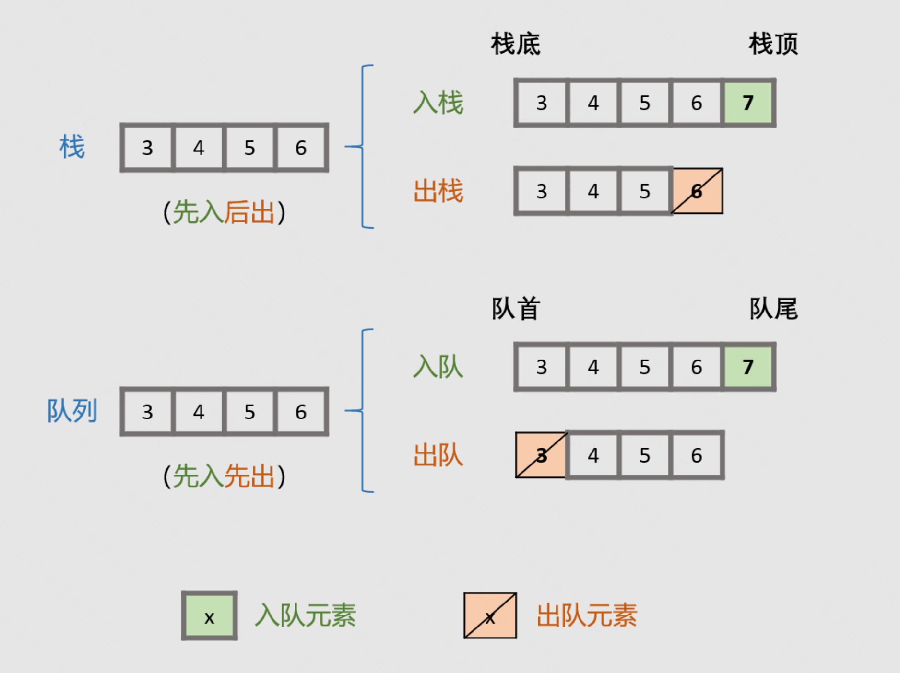
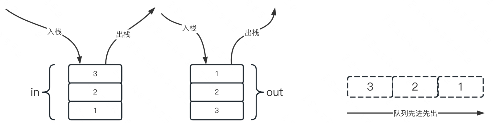
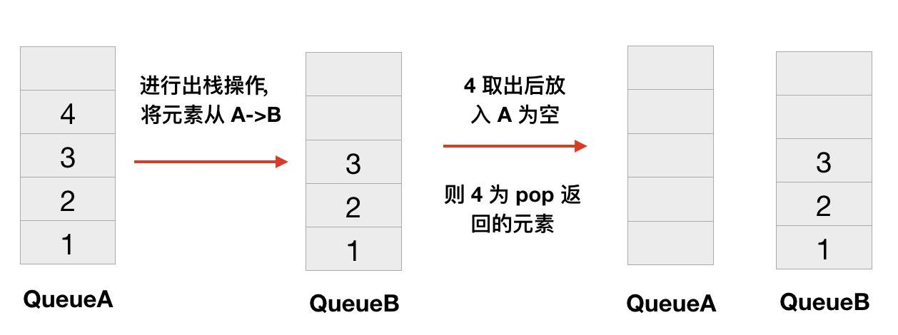
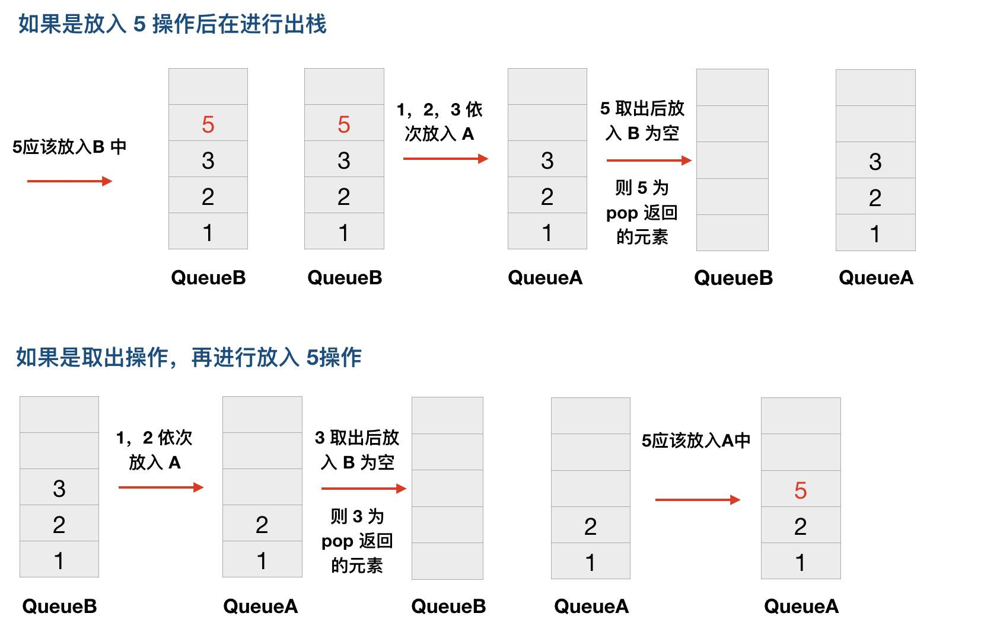

# 队列

## 队列简介

**队列（Queue）** 是 **先进先出 (FIFO，First In, First Out)** 的线性表。在具体应用中通常用链表或者数组来实现，用数组实现的队列叫作 **顺序队列** ，用链表实现的队列叫作 **链式队列** 。**队列只允许在后端（rear）进行插入操作也就是入队 enqueue，在前端（front）进行删除操作也就是出队 dequeue**

队列的操作方式和堆栈类似，唯一的区别在于队列只允许新数据在后端进行添加。

```java
假设队列中有n个元素。
访问：O（n）//最坏情况
插入删除：O（1）//后端插入前端删除元素
```



### 队列分类

#### 单队列

单队列就是常见的队列, 每次添加元素时，都是添加到队尾。单队列又分为 **顺序队列（数组实现）** 和 **链式队列（链表实现）**。

**顺序队列存在“假溢出”的问题也就是明明有位置却不能添加的情况。**

假设下图是一个顺序队列，我们将前两个元素 1,2 出队，并入队两个元素 7,8。当进行入队、出队操作的时候，front 和 rear 都会持续往后移动，当 rear 移动到最后的时候,我们无法再往队列中添加数据，即使数组中还有空余空间，这种现象就是 **”假溢出“** 。除了假溢出问题之外，如下图所示，当添加元素 8 的时候，rear 指针移动到数组之外（越界）。

> 为了避免当只有一个元素的时候，队头和队尾重合使处理变得麻烦，所以引入两个指针，front 指针指向对头元素，rear 指针指向队列最后一个元素的下一个位置，这样当 front 等于 rear 时，此队列不是还剩一个元素，而是空队列。——From 《大话数据结构》



#### 循环队列

循环队列可以解决顺序队列的假溢出和越界问题。解决办法就是：从头开始，这样也就会形成头尾相接的循环，这也就是循环队列名字的由来。

还是用上面的图，我们将 rear 指针指向数组下标为 0 的位置就不会有越界问题了。当我们再向队列中添加元素的时候， rear 向后移动。



顺序队列中，我们说 `front==rear` 的时候队列为空，循环队列中则不一样，也可能为满，如上图所示。解决办法有两种：

1. 可以设置一个标志变量 `flag`,当 `front==rear` 并且 `flag=0` 的时候队列为空，当`front==rear` 并且 `flag=1` 的时候队列为满。
2. 队列为空的时候就是 `front==rear` ，队列满的时候，我们保证数组还有一个空闲的位置，rear 就指向这个空闲位置，如下图所示，那么现在判断队列是否为满的条件就是：`(rear+1) % QueueSize==front` 。

#### 双端队列

**双端队列 (Deque)** 是一种在队列的两端都可以进行插入和删除操作的队列，相比单队列来说更加灵活。

一般来说，我们可以对双端队列进行 `addFirst`、`addLast`、`removeFirst` 和 `removeLast` 操作。

#### 优先队列

**优先队列 (Priority Queue)** 从底层结构上来讲并非线性的数据结构，它一般是由堆来实现的。

1. 在每个元素入队时，优先队列会将新元素其插入堆中并调整堆。
2. 在队头出队时，优先队列会返回堆顶元素并调整堆。

关于堆的具体实现可以看[堆](https://javaguide.cn/cs-basics/data-structure/heap.html)这一节。

总而言之，不论我们进行什么操作，优先队列都能按照**某种排序方式**进行一系列堆的相关操作，从而保证整个集合的**有序性**。

虽然优先队列的底层并非严格的线性结构，但是在我们使用的过程中，我们是感知不到**堆**的，从使用者的眼中优先队列可以被认为是一种线性的数据结构：一种会自动排序的线性队列。

### 队列的常见应用场景

当我们需要按照一定顺序来处理数据的时候可以考虑使用队列这个数据结构。

- **阻塞队列：** 阻塞队列可以看成在队列基础上加了阻塞操作的队列。当队列为空的时候，出队操作阻塞，当队列满的时候，入队操作阻塞。使用阻塞队列我们可以很容易实现“生产者 - 消费者“模型。
- **线程池中的请求/任务队列：** 当线程池中没有空闲线程时，新的任务请求线程资源会被如何处理呢？答案是这些任务会被放入任务队列中，等待线程池中的线程空闲后再从队列中取出任务执行。任务队列分为无界队列（基于链表实现）和有界队列（基于数组实现）。无界队列的特点是队列容量理论上没有限制，任务可以持续入队，直到系统资源耗尽。例如：`FixedThreadPool` 使用的阻塞队列 `LinkedBlockingQueue`，其默认容量为 `Integer.MAX_VALUE`，因此可以被视为“无界队列”。而有界队列则不同，当队列已满时，如果再有新任务提交，由于队列无法继续容纳任务，线程池会拒绝这些任务，并抛出 `java.util.concurrent.RejectedExecutionException` 异常。
- **栈**：双端队列天生便可以实现栈的全部功能（`push`、`pop` 和 `peek`），并且在 Deque 接口中已经实现了相关方法。Stack 类已经和 Vector 一样被遗弃，现在在 Java 中普遍使用双端队列（Deque）来实现栈。
- **广度优先搜索（BFS）**：在图的广度优先搜索过程中，队列被用于存储待访问的节点，保证按照层次顺序遍历图的节点。
- Linux 内核进程队列（按优先级排队）
- 现实生活中的派对，播放器上的播放列表;
- 消息队列
- 等等……




## 解题技巧

### 两个栈实现一个队列

- 方法：
  
- 优化：
    - 入队时，将元素压入s1。
    - 出队时，判断s2是否为空，如不为空，则直接弹出顶元素；如为空，则将s1的元素逐个“倒入”s2，把最后一个元素弹出并出队。

### 两个队列实现栈




- 任何时候两个队列总有一个是空的。
- 添加元素总是向非空队列中 add 元素。
- 取出元素的时候总是将元素除队尾最后一个元素外，导入另一空队列中，最后一个元素出队。

### 获取单链表的中间节点

- 输入链表头节点，奇数长度返回中点，偶数长度返回上中点
- 输入链表头节点，奇数长度返回中点，偶数长度返回下中点
- 输入链表头节点，奇数长度返回中点前一个，偶数长度返回上中点前一个
- 输入链表头节点，奇数长度返回中点前一个，偶数长度返回下中点前一个

### 单调队列 Monotonous Queue

- 使用单调队列，实现窗口内最大值或最小值的更新结构
- 能够方便获取某个区间内（滑动窗口）的最大值或最小值


