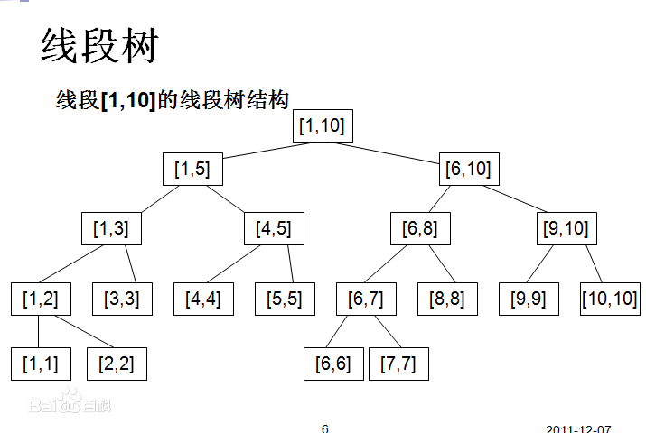

# 线段树 SegmentTree

> **参考**
> - [线段树](https://oi-wiki.org/ds/seg/)
> - [Segment Tree](https://cp-algorithms.com/data_structures/segment_tree.html)

- 线段树是一种二叉搜索树，与区间树相似，它将一个区间划分成一些单元区间，每个单元区间对应线段树中的一个叶结点。
- 使用线段树可以快速的查找某一个节点在若干条线段中出现的次数，时间复杂度为O(logN)。而未优化的空间复杂度为2N，实际应用时一般还要开4N的数组以免越界，因此有时需要离散化让空间压缩。
- 对于线段树中的每一个非叶子节点[a,b]，它的左儿子表示的区间为[a,(a+b)/2]，右儿子表示的区间为[(a+b)/2+1,b]。因此线段树是平衡二叉树，最后的子节点数目为N，即整个线段区间的长度。
- Lazy思想：对整个结点进行的操作，先在结点上做标记，而并非真正执行，直到根据查询操作的需要分成两部分。来解决每次修改都会全量更新的性能下降。

