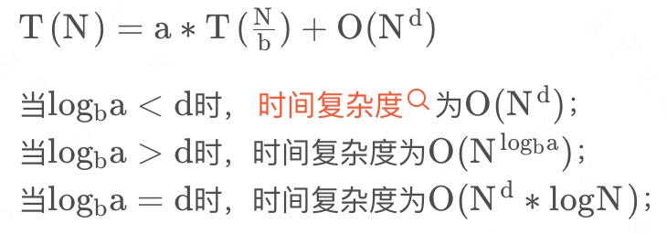

# 算法总结

## Master 公式

### 什么是 Master 公式

Master 公式是用来利用分治策略解决问题经常使用的时间复杂度的分析方法

分治策略中使用递归来求解问题分为三步走，分别为分解、解决和合并

### Master 公式解释

- a：生成的子问题数（比如二叉树的递归遍历就是 a = 2)
- b：表示每次递归是母问题的1/b的数据规模
- N：母问题的数据规模
- d：额外操作的次数

**注：使用Master公式分析递归问题时间复杂度时，各子问题的数据规模应该是一致的，否则不能使用Master公式。**

## 子串、子序列

对于一个字符串而言，比如：pikachu

- 字串是在字符串中，取出一块（连续的），如：pik, ach, kac等
- 子序列指的是从字符串中，顺序取出字符，但是可以不连续：如：pau, kch, icu等

## 贪心算法

### 算法思想

贪心的本质是选择每一阶段的局部最优，从而达到全局最优。

### 一般解题步骤

- 将问题分解为若干个子问题
- 找出适合的贪心策略
- 求解每一个子问题的最优解
- 将局部最优解堆叠成全局最优解

### LeetCode

455.分发饼干：<https://leetcode.cn/problems/assign-cookies/>

121.买卖股票的最佳时机：<https://leetcode.cn/problems/best-time-to-buy-and-sell-stock/>

122.买卖股票的最佳时机 II：<https://leetcode.cn/problems/best-time-to-buy-and-sell-stock-ii/>

55.跳跃游戏：<https://leetcode.cn/problems/jump-game/>

45.跳跃游戏 II：<https://leetcode.cn/problems/jump-game-ii/>

## 动态规划

### 算法思想

动态规划中每一个状态一定是由上一个状态推导出来的，这一点就区分于贪心，贪心没有状态推导，而是从局部直接选最优的。

经典题目：01 背包、完全背包

### 一般解题步骤

- 确定 dp 数组（dp table）以及下标的含义
- 确定递推公式
- dp 数组如何初始化
- 确定遍历顺序
- 举例推导 dp 数组

### LeetCode

509.斐波那契数：<https://leetcode.cn/problems/fibonacci-number/>

746.使用最小花费爬楼梯：<https://leetcode.cn/problems/min-cost-climbing-stairs/>

416.分割等和子集：<https://leetcode.cn/problems/partition-equal-subset-sum/>

518.零钱兑换：<https://leetcode.cn/problems/coin-change-ii/>

647.回文子串：<https://leetcode.cn/problems/palindromic-substrings/>

516.最长回文子序列：<https://leetcode.cn/problems/longest-palindromic-subsequence/>

## 回溯算法

### 算法思想

回溯算法实际上一个类似枚举的搜索尝试过程，主要是在搜索尝试过程中寻找问题的解，当发现已不满足求解条

件时，就“回溯”返回，尝试别的路径。其本质就是穷举。

经典题目：8 皇后

### 一般解题步骤

- 针对所给问题，定义问题的解空间，它至少包含问题的一个（最优）解。
- 确定易于搜索的解空间结构,使得能用回溯法方便地搜索整个解空间 。
- 以深度优先的方式搜索解空间，并且在搜索过程中用剪枝函数避免无效搜索。

### leetcode

77.组合：<https://leetcode.cn/problems/combinations/>

39.组合总和：<https://leetcode.cn/problems/combination-sum/>

40.组合总和 II：<https://leetcode.cn/problems/combination-sum-ii/>

78.子集：<https://leetcode.cn/problems/subsets/>

90.子集 II：<https://leetcode.cn/problems/subsets-ii/>

51.N 皇后：<https://leetcode.cn/problems/n-queens/>

## 分治算法

### 算法思想

将一个规模为 N 的问题分解为 K 个规模较小的子问题，这些子问题相互独立且与原问题性质相同。求出子问题的解，就可得到原问题的解。

经典题目：二分查找、汉诺塔问题

### 一般解题步骤

- 将原问题分解为若干个规模较小，相互独立，与原问题形式相同的子问题；
- 若子问题规模较小而容易被解决则直接解，否则递归地解各个子问题
- 将各个子问题的解合并为原问题的解。

### LeetCode

108.将有序数组转换成二叉搜索数：<https://leetcode.cn/problems/convert-sorted-array-to-binary-search-tree/>

148.排序列表：<https://leetcode.cn/problems/sort-list/>

23.合并 k 个升序链表：<https://leetcode.cn/problems/merge-k-sorted-lists/>

## 资源限制技巧汇总

- 布隆过滤器用于集合的建立与查询，并可以节省大量空间
- 一致性哈希解决数据服务器的负载管理问题
- 利用并查集结构做岛问题的并行计算
- 哈希函数可以把数据按照种类均匀分流
- 位图解决某一范围上数字的出现情况，并可以节省大量空间
- 利用分段统计思想，进一步节省大量空间
- 利用堆、外排序来做出出力单元的结果合并

## 相关题目解题
* [题目解析](/docs/alg/problem/)