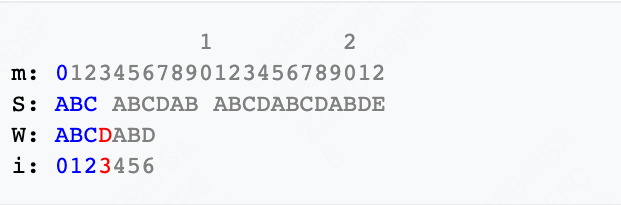
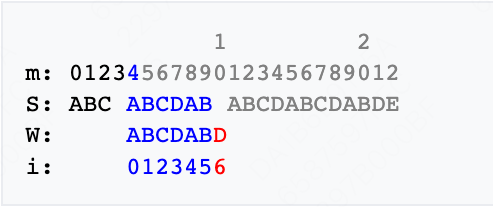
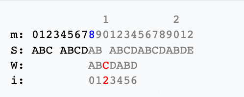
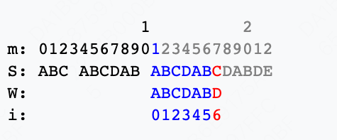
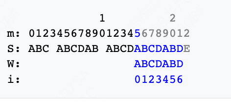

# KMP - str1 是否包含 str2

- 字符串匹配算法
- 尽可能利用残余的信息，是KMP算法的思想所在。
- 以W="ABCDABD"，S="ABC ABCDAB ABCDABCDABDE"为例说明查找过程。查找过程同时使用两个循环变量m和i：
    - m代表主文字符串S内匹配字符串W的当前查找位置，
    - i代表匹配字符串W当前做比较的字符位置。如图：
      
    - 从W与S的开头比较起。比对到S[3](=' ')时，发现W[3](='D')与之不符。接著并不是从S[1]比较下去。已经知道S[1]~S[3]不与W[0]相合。因此，略过这些字元，令m = 4以及i = 0。
      
    - 如上所示，检核了"ABCDAB"这个字串。然而，下一字符便不相合。可以注意到，"AB"在"ABCDAB"的头尾处均有出现。这意味著尾端的"AB"可以作为下次比较的起始点。因此，令m = 8, i = 2，继续比较。图示如下：
      
    - 于m = 10的地方，又出现不相符的情况。类似地，令m = 11, i = 0继续比较：
      
    - 这时，S[17](='C')不与W[6]相同，但是已匹配部分"ABCDAB"亦为首尾均有"AB"，采取一贯的作法，令m = 15和i = 2，继续搜寻。
      
    - 找到完全匹配的字串了，其起始位置于S[15]的地方。
- 求 next 数组
-
- 参考
    - [KMP 算法](https://zq99299.github.io/dsalg-tutorial/dsalg-java-hsp/14/04.html#%E5%BA%94%E7%94%A8%E5%9C%BA%E6%99%AF-%E5%AD%97%E7%AC%A6%E4%B8%B2%E5%8C%B9%E9%85%8D%E9%97%AE%E9%A2%98)
    - [KMP 算法](https://www.cnblogs.com/zzuuoo666/p/9028287.html)
